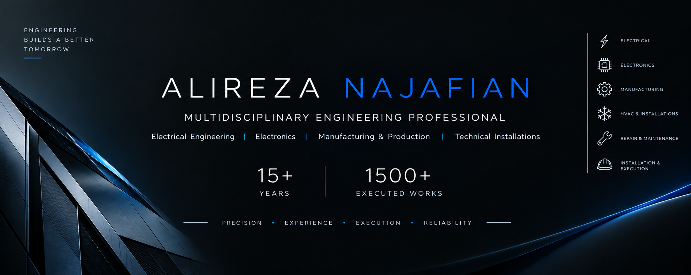

<div align="center">



</div>

<br>

<div align="center">

# ⚙️ ALIREZA NAJAFIAN

### MULTIDISCIPLINARY ENGINEERING PROFESSIONAL

**Electrical Engineering · Electronics · Manufacturing & Production · Technical Installations**

<br>

[](#-professional-experience)
[](#-1500-executed-works)
[](#-core-expertise)
[](#-core-expertise)

<br>

**15+ Years of Practical Experience · 1500+ Executed Works · Multidisciplinary Technical Expertise**

</div>

---

# 👨‍🔧 About Me

I am **Alireza Najafian**, a multidisciplinary engineering professional with more than **15 years of professional experience** and more than **1500 executed technical works and projects** across electrical engineering, electronics, manufacturing and production, building electrical systems, technical installations, repair, maintenance, and equipment installation.

My professional background combines **engineering knowledge with extensive hands-on experience**, allowing me to approach technical challenges from both analytical and practical perspectives.

My experience includes electrical systems, electronic equipment, manufacturing and production processes, building installations, HVAC and heating systems, technical equipment, installation, maintenance, repair, troubleshooting, and commissioning.

My professional approach is based on **precision, systematic troubleshooting, practical execution, reliability, and continuous technical improvement**.

---

# 🏆 Professional Highlights

<div align="center">

|   Experience  | Executed Works |            Main Domains           |
| :-----------: | :------------: | :-------------------------------: |
| **15+ Years** |    **1500+**   | **Multidisciplinary Engineering** |

</div>

### Professional Experience Includes

* Electrical Engineering
* Power Electrical Systems
* Building Electrical Systems
* Electronics
* Manufacturing & Production
* Technical Installations
* HVAC Systems
* Heating Systems
* Equipment Installation
* Repair & Maintenance
* Troubleshooting & Diagnostics
* Technical Execution
* ICDL & Computer Skills

---

# ⚡ Core Expertise

## ⚡ Power Electrical Engineering

* Electrical power systems
* Electrical distribution
* Electrical equipment
* Electrical protection
* Electrical wiring
* Power circuits
* Electrical troubleshooting
* Electrical maintenance
* Equipment installation
* Fault diagnosis
* Technical inspection

---

## 🏢 Building Electrical Systems

* Building electrical installations
* Electrical wiring
* Distribution boards
* Lighting systems
* Power circuits
* Electrical equipment installation
* Electrical troubleshooting
* Maintenance and repair
* Fault detection
* Electrical system inspection

---

## 🔌 Electronics

* Electronic circuits
* Electronic components
* Circuit analysis
* Sensors and control components
* Electronic equipment
* Electronic troubleshooting
* Hardware diagnostics
* Equipment repair
* Electronic maintenance
* Practical electronic systems

---

## 🏭 Manufacturing & Production

* Manufacturing processes
* Production systems
* Industrial equipment
* Technical execution
* Equipment analysis
* Production-oriented problem solving
* Maintenance-oriented engineering
* Technical documentation
* Process improvement
* Practical engineering solutions

---

## 🏢 Technical Installations & Facilities

* Technical building installations
* HVAC systems
* Air-conditioning systems
* Heating systems
* Package boiler systems
* Pumps and circulation systems
* Mechanical installations
* Electrical installations
* Installation and commissioning
* Preventive maintenance
* Troubleshooting

---

## 🔧 Repair & Maintenance

* Electrical equipment repair
* Electronic equipment repair
* Preventive maintenance
* Corrective maintenance
* Fault diagnosis
* Equipment troubleshooting
* System inspection
* Component replacement
* Equipment testing
* Performance evaluation
* Technical maintenance

---

## 🛠️ Installation & Execution

Extensive hands-on experience in technical execution, including:

* Installation
* Assembly
* Equipment setup
* Electrical connections
* System commissioning
* System testing
* Fault detection
* Repair
* Maintenance
* Technical implementation

---

## 💻 ICDL & Computer Skills

* ICDL
* Computer fundamentals
* Microsoft Word
* Microsoft Excel
* Microsoft PowerPoint
* Internet and digital tools
* Technical documentation
* Digital workplace skills

---

# 🎓 Education & Professional Qualifications

### Engineering & Technical Qualifications

* **مهندسی ساخت و تولید**
* **مهندسی برق**
* **مهندسی الکترونیک**
* **برق قدرت**
* **برق ساختمان**
* **الکترونیک**
* **تأسیسات فنی و ساختمانی**
* **نصب و راه‌اندازی تجهیزات**
* **تعمیر و نگهداری تجهیزات**
* **ICDL و مهارت‌های تخصصی کامپیوتر**

---

# 🧠 Engineering Approach

My professional approach is built around a structured engineering process:

### 01 — Understand

Understand the complete system, equipment, and operating conditions.

### 02 — Analyze

Analyze the technical structure and identify possible failure points.

### 03 — Diagnose

Find the actual root cause instead of treating only the visible symptom.

### 04 — Execute

Implement a practical, technically sound, and reliable solution.

### 05 — Test

Test the system or equipment after installation, repair, or modification.

### 06 — Verify

Verify performance, reliability, and correct operation.

### 07 — Maintain

Focus on long-term reliability, serviceability, and preventive maintenance.

---

# 🚀 1500+ Executed Works

## Extensive Practical Experience

Throughout more than **15 years of professional activity**, I have completed and participated in **1500+ technical works and projects** across multiple engineering and technical fields.

These works include:

```text
Electrical Installation
Electrical Troubleshooting
Power Electrical Systems
Building Electrical Systems
Electronic Systems
Equipment Installation
Equipment Repair
Technical Installations
HVAC Systems
Heating Systems
Maintenance
Fault Diagnosis
Manufacturing & Production
Technical Services
System Testing
Commissioning
```

> The 1500+ figure represents the accumulated volume of executed technical work and projects throughout professional activity.

---

# 🔍 Technical Problem Solving

Technical troubleshooting is an important part of my professional experience.

My troubleshooting methodology follows a structured process:

```text
OBSERVE
   ↓
ANALYZE
   ↓
DIAGNOSE
   ↓
IDENTIFY ROOT CAUSE
   ↓
IMPLEMENT SOLUTION
   ↓
TEST
   ↓
VERIFY
   ↓
RETURN TO SERVICE
```

This approach can be applied across electrical, electronic, installation, maintenance, manufacturing, and equipment-related problems.

---

# 🏗️ Engineering Domains

<div align="center">

**⚡ POWER ELECTRICAL**

↓

**🏢 BUILDING ELECTRICAL**

↓

**🔌 ELECTRONICS**

↓

**🏭 MANUFACTURING & PRODUCTION**

↓

**🏢 TECHNICAL INSTALLATIONS**

↓

**❄️ HVAC & HEATING**

↓

**🔧 REPAIR & MAINTENANCE**

↓

**🛠️ INSTALLATION & COMMISSIONING**

</div>

---

# 🧰 Technical Capabilities

| Engineering Area       | Technical Capabilities                                    |
| ---------------------- | --------------------------------------------------------- |
| ⚡ Electrical           | Power systems, wiring, distribution, troubleshooting      |
| 🏢 Building Electrical | Electrical installations, lighting, power circuits        |
| 🔌 Electronics         | Circuits, components, diagnostics, repair                 |
| 🏭 Manufacturing       | Manufacturing, production, equipment, technical execution |
| 🏢 Facilities          | HVAC, heating, cooling, technical installations           |
| 🔧 Maintenance         | Preventive & corrective maintenance                       |
| 🛠️ Installation       | Installation, commissioning, testing                      |
| 💻 Computer            | ICDL, Office, digital documentation                       |

---

# 📂 Professional Documentation

This professional portfolio can document:

* Technical projects
* Engineering solutions
* Executed works
* Technical documentation
* Equipment information
* Maintenance cases
* Troubleshooting cases
* Engineering notes
* Technical experiments
* Selected field projects
* Installation and commissioning records

---

# 🤝 Professional Collaboration

Open to professional collaboration and technical projects related to:

`Electrical Engineering` · `Power Systems` · `Building Electrical Systems`

`Electronics` · `Manufacturing & Production` · `Technical Installations`

`HVAC` · `Heating Systems` · `Repair & Maintenance`

`Installation` · `Commissioning` · `Technical Services`

---

# 🇮🇷 درباره من

من **علیرضا نجفیان**، متخصص و فعال چندحوزه‌ای در زمینه مهندسی و امور فنی، با بیش از **۱۵ سال سابقه کاری** و بیش از **۱۵۰۰ کار و پروژه اجرایی** هستم.

حوزه‌های اصلی فعالیت و تخصص من شامل:

* ⚡ برق قدرت
* 🏢 برق ساختمان
* 🔌 الکترونیک
* 🏭 ساخت و تولید
* 🏢 تأسیسات
* ❄️ سیستم‌های سرمایشی و گرمایشی
* 🔧 تعمیر و نگهداری
* 🛠️ نصب و راه‌اندازی
* 🔍 عیب‌یابی و تشخیص مشکلات فنی
* 💻 ICDL و مهارت‌های کامپیوتری

تجربه حرفه‌ای من ترکیبی از **دانش مهندسی، تجربه عملی و اجرای پروژه در محیط واقعی** است.

هدف اصلی در فعالیت‌های فنی، بررسی دقیق سیستم، شناسایی علت اصلی مشکل، اجرای راهکار مناسب و اطمینان از عملکرد صحیح و پایدار سیستم است.

---

# ⚡ حوزه‌های تخصصی

### برق قدرت

سیستم‌های قدرت، تجهیزات الکتریکی، توزیع برق، سیم‌کشی، عیب‌یابی، تعمیر و نگهداری.

### برق ساختمان

اجرای سیستم‌های برق ساختمان، تابلوها، مدارهای روشنایی و قدرت، نصب تجهیزات و عیب‌یابی.

### الکترونیک

مدارهای الکترونیکی، قطعات، تجهیزات الکترونیکی، عیب‌یابی، تعمیر و نگهداری.

### ساخت و تولید

فرآیندهای ساخت و تولید، تجهیزات، اجرای فنی، تحلیل تجهیزات و حل مسائل عملی.

### تأسیسات

تأسیسات فنی و ساختمانی، سیستم‌های تهویه، سرمایش، گرمایش، پکیج، پمپ‌ها و تجهیزات مرتبط.

### تعمیر و نگهداری

تعمیر تجهیزات، نگهداری پیشگیرانه، عیب‌یابی، تشخیص خرابی و بازگرداندن تجهیزات به شرایط کاری مناسب.

### نصب و راه‌اندازی

نصب، مونتاژ، اتصال، تست، راه‌اندازی و بررسی عملکرد تجهیزات و سیستم‌های فنی.

### ICDL

مهارت‌های هفت‌گانه کامپیوتر، نرم‌افزارهای اداری و مستندسازی دیجیتال.

---

# 📊 Professional Experience

<div align="center">

### 🕐 15+ YEARS OF PROFESSIONAL EXPERIENCE

### 🛠️ 1500+ EXECUTED WORKS & PROJECTS

### ⚡ MULTIDISCIPLINARY TECHNICAL EXPERTISE

<br>

**Engineering Knowledge + Practical Experience + Real-World Execution**

</div>

---

# 🎯 Professional Philosophy

> **Precision. Experience. Execution. Reliability.**

مهندسی فقط شناخت یک سیستم نیست؛

بلکه توانایی **درک، تحلیل، اجرا، عیب‌یابی، تعمیر و بهبود آن سیستم در دنیای واقعی** است.

---

<div align="center">

# ⚙️ ENGINEERING · EXPERIENCE · EXECUTION

### 15+ YEARS OF PROFESSIONAL EXPERIENCE

### 1500+ EXECUTED WORKS & PROJECTS

**Electrical · Electronics · Manufacturing · Installations · Repair · Maintenance**

<br>

**Precision · Reliability · Practical Engineering**

<br><br>

© Alireza Najafian

</div>
